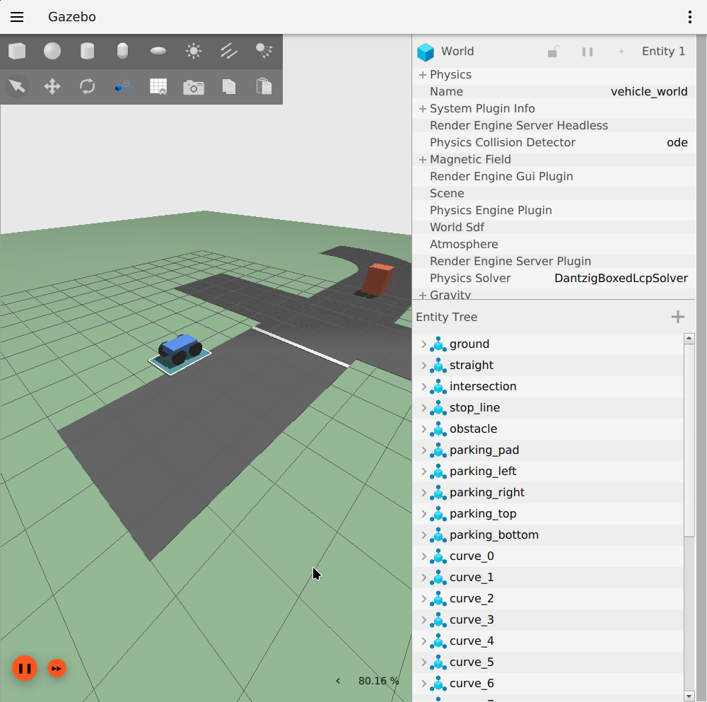

# 전진·후진·좌우 회전·파킹 한 번에 실행

## 1. 주행 예시 스크립트 실행

호스트 터미널에서 한 줄 실행합니다.

```bash
sh /home/lee/hint/HINT-ROS2-HIL/run_vehicle.sh
```

프로젝트 폴더에 있다면 `sh run_vehicle.sh`로 실행할 수 있습니다. 스크립트가 Docker 컨테이너, C++ 빌드, Gazebo/RViz, 주행 명령을 모두 준비합니다. 최초 빌드 후 약 28초의 시뮬레이션 시간 동안 움직입니다.

Docker 접근 권한, DISPLAY와 xhost가 필요합니다. 실제 Decision이나 다른 명령 발행자는 먼저 종료하세요. 시연 중에는 C++ 프로그램이 임시 Decision 역할로 `/cmd_vel`을 발행합니다.

시연이 끝나도 주차한 차량 화면은 열려 있습니다. 터미널에서 Ctrl+C로 종료하고 같은 sh 명령으로 다시 실행합니다.

GUI 없이 검사 후 자동 종료하려면:

```bash
sh /home/lee/hint/HINT-ROS2-HIL/run_vehicle.sh --headless
```

## 2. 화면에서 확인할 순서

| 순서 | 동작 | 시간 | v (m/s) | w (rad/s) | 눈으로 확인할 내용 |
|---|---|---:|---:|---:|---|
| 1 | 준비 | 1초 | 0 | 0 | 시작점 정지 |
| 2 | 전진 | 3초 | 0.5 | 0 | 직선으로 앞으로 이동 |
| 3 | 정지 | 1초 | 0 | 0 | 이동 중단 |
| 4 | 후진 | 3초 | -0.5 | 0 | 시작점 방향으로 복귀 |
| 5 | 정지 | 1초 | 0 | 0 | 회전 전 대기 |
| 6 | 좌회전 | 5초 | 0.3 | 0.3 | 왼쪽 곡선 주행 |
| 7 | 정지 | 1초 | 0 | 0 | 좌회전 종료 |
| 8 | 우회전 | 5초 | 0.3 | -0.3 | 오른쪽 곡선으로 방향 복귀 |
| 9 | 정지 | 1초 | 0 | 0 | 후진 주차 준비 |
| 10 | 파킹 | 2.5초 | -0.3 | 0 | 주차선 안으로 저속 후진 |
| 11 | 파킹 완료 | 3초 | 0 | 0 | 주차 위치에서 정지 유지 |

구간마다 터미널에 동작 이름과 실제 월드 x/y 위치를 출력합니다. 마지막에는 주차 구역 안의 위치와 실제 정지속도를 검사합니다. 성공하면 `[완료] 주차 구역 안에 정지했습니다.`가 표시됩니다. 종료 후에도 Vehicle은 명령 timeout으로 정지를 유지합니다.

## 3. 실제 시연 결과

2026-10-05에 `driving_demo.sh`를 실제 Gazebo GUI에서 실행했습니다. 전진·후진·좌회전·우회전·후진 주차를 모두 완료했고 종료 코드 0입니다. 마지막 월드 위치는 약 x=1.365 m, y=1.861 m이며, 주차 구역 안에서 정지 조건을 통과했습니다.



## 4. 중단과 다시 실행

실행한 터미널에서 Ctrl+C를 누르면 시연과 Gazebo/RViz/Vehicle이 함께 종료됩니다. 같은 sh 명령을 다시 실행하면 새 월드의 시작점으로 복귀합니다. 시작점이 아니거나 다른 명령 발행자가 있으면 시연 프로그램은 실행을 거부합니다. 피드백이 끊기면 정지 명령을 보내고 시연을 중단합니다.

## 5. 관련 코드와 문서

| 파일 | 용도 |
|---|---|
| `run_vehicle.sh` | 호스트 한 줄 실행 스크립트 |
| `ros2_ws/src/vehicle_node/scripts/run_demo_in_container.sh` | 자동 빌드·launch·시연 및 종료 |
| `ros2_ws/src/vehicle_node/src/driving_demo.cpp` | 주석이 있는 C++ 시연 시퀀스 |
| [COMMANDS.md](COMMANDS.md) | 동작별 수동 명령 |
| [INTERFACES.md](INTERFACES.md) | Vehicle ↔ Decision 메시지 계약 |
| [VALIDATION.md](VALIDATION.md) | 4륜 명령 검증 결과 |

시간 기반 시퀀스이므로 시작 위치, 물리 설정, 다른 충돌 조건을 바꾸면 주차 도착 위치도 달라집니다. 실제 자율주차를 하려면 Decision에서 경로와 피드백 제어를 구현해야 합니다.
